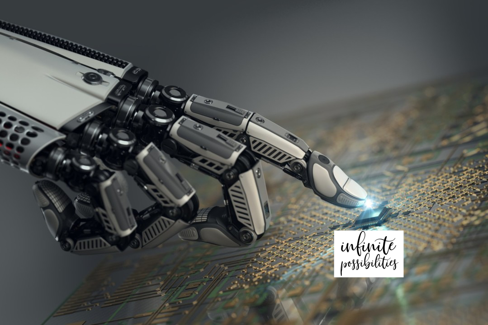
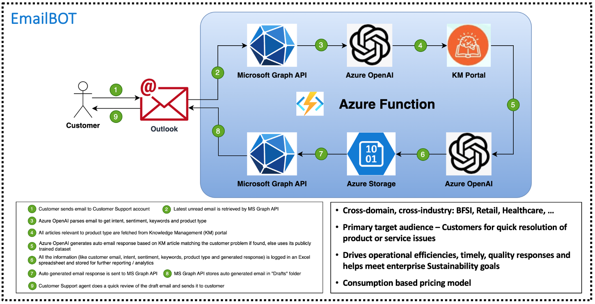
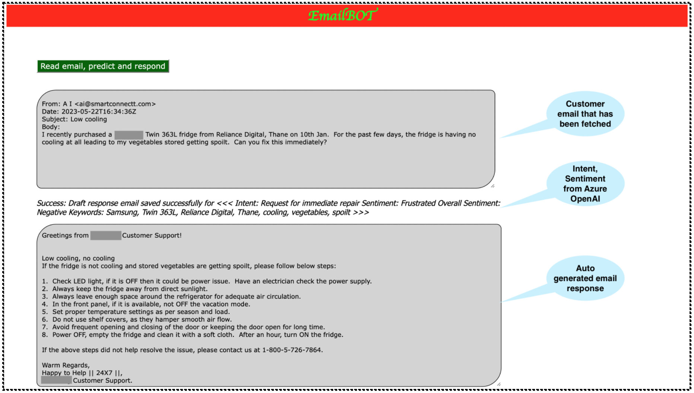

  

# Generative AI in Enterprises: infinite possibilities for powering next generation CEP-X
Generative AI, like ChatGPT, has taken the world by storm with 100 million users and 1.8 billion hits on its website, within 3 months of launch.  

While it can write poetry, help students in assignments, compose novels and a whole lot of other personal tasks, ChatGPT can play a very important role in enterprises next generation Customer, Employee, Partner Experiences (CEP-X).

Despite a plethoria of support applications, service experienced by a customer or employee or partner is often poor. An ideal CEP-X omnichannel platform will provide quality, automated timely responses, self-serve options, available 24x7.  With its generative capabilities, ChatGPT can help enterprises achieve better CSAT / NPS, operational efficiencies and achieve Sustainability goals.

One of the key concerns for enterprises is data privacy and data security.  So, I have been developing enterprise solutions with Microsoft’s Azure OpenAI version of ChatGPT.  Further, these solutions are integrated with enterprise knowledge base portals having approved content - thus ensuring only appropriate responses are provided.

Two of the solutions which have been developed include an **EmailBOT** and **InfoAssistBOT**.

## EmailBOT
EmailBOT automatically processes an incoming customer email for intent, sentiment with Azure OpenAI and generates an automated response based on enterprise knowledge base information. Below is the solution’s reference architecture and a demo screenshot.

  

  

