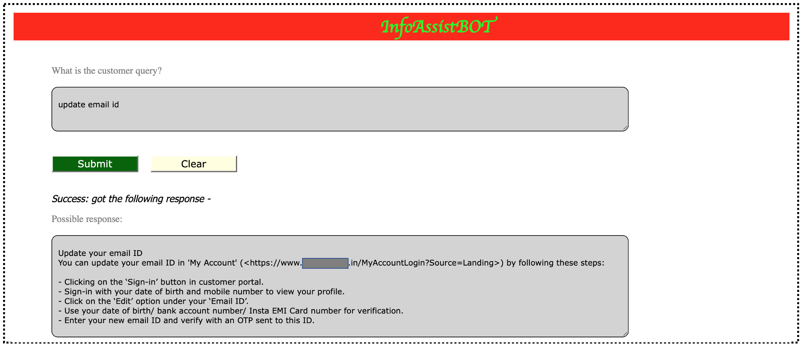

  

# Generative AI in Enterprises: infinite possibilities for powering next generation CEP-X
The incredible impact of Generative AI like ChatGPT has swept the world off its feet, captivating a staggering 100 million users, and receiving a remarkable 1.8 billion hits on its website within a mere three months. While it has been used for crafting poetry to assist students with assignments and even composing novels, the true potential of ChatGPT lies in revolutionizing the Customer, Employee, and Partner Experiences (CEP-X) of enterprises.

In a landscape cluttered with numerous support and service apps, service quality often falls short. An ideal CEP-X omnichannel platform will deliver automated, timely responses and 24x7 self-service options. By harnessing the power of Generative AI, enterprises can elevate their Customer Satisfaction (CSAT) and Net Promoter Scores (NPS), streamline operations, and effectively work towards achieving sustainability goals.

When it comes to enterprises, safeguarding data privacy and security is paramount. That's why I am developing enterprise solutions with Microsoft's Azure OpenAI version of ChatGPT. These solutions seamlessly integrate with enterprise knowledge base portals having approved content, thus ensuring robust guardrails are in place to prevent undesirable responses.

Two of the solutions which have been developed include an **EmailBOT** and **InfoAssistBOT**.

## EmailBOT
EmailBOT is an automated processing system for incoming customer emails, analyzing intent and sentiment using Azure OpenAI. Based on the knowledge stored in an enterprise's databases, EmailBOT generates personalized, automated responses.  Below is a reference architecture and demo screenshot of the solution.

  

  

## InfoAssistBOT
InfoAssistBOT is an omnichannel virtual assistant enabling quick, timely and quality access to information 24x7. Below is a reference architecture and demo screenshots of the solution.

  

  

  

